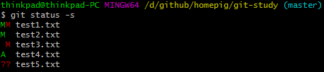
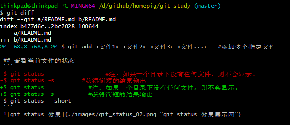

# Git 学习、练习项目

> ## 目录
> 1. [学习网址](#学习网址)
> 2. [Git文件的三种状态](#Git文件的三种状态)
> 3. [Git项目的三个工作区的概念](#Git项目的三个工作区的概念)
> 4. [Git配置](#Git配置)
>    1. [Git配置文件存放路径](#Git配置文件存放路径)
>    2. [Git常用配置](#Git常用配置)
> 5. [Git帮助查看命令](#Git帮助查看)
> 6. [获取Git仓库](#获取Git仓库)
>    1. [初始化仓库](#初始化仓库)
>    1. [克隆现有的仓库](#克隆现有的仓库)
> 7. [添加新文件或修改文件到暂存区](#添加新文件或修改文件到暂存区)
> 8. [查看当前文件的状态](#查看当前文件的状态)
> 9. [查看文件改动](#查看文件改动)
> 10. [提交暂存区中的更改到本地仓库](#提交暂存区中的更改到本地仓库)
> 11. [从Git仓库中删除文件](#从Git仓库中删除文件)
> 12. [移动或重命名一个文件、目录](#移动或重命名一个文件、目录)
> 13. [查看提交历史](#查看提交历史)
> 14. [撤销操作](#撤销操作)
>     1. [重新提交](#重新提交)
>     2. [取消暂存的文件](#取消暂存的文件)
>     3. [撤销工作区的修改](#撤销工作区的修改)
> 15. [远程仓库的使用](#远程仓库的使用)
>     1. [查看仓库](#查看仓库)
>     2. [添加远程仓库](#添加远程仓库)
>     3. [删除远程仓库](#删除远程仓库)
>     4. [重命名远程仓库](#重命名远程仓库)
>     5. [提取远程仓库](#提取远程仓库)
>     6. [推送远程仓库](#推送远程仓库)
> 16. [打标签](#打标签)
>     1. [列出标签](#列出标签)
>     2. [打附注标签](#打附注标签)
>     3. [打轻量标签](#打轻量标签)
>     4. [删除标签](#删除标签)
>     5. [查看标签详情](#查看标签详情)
>     6. [共享标签](#共享标签)
>     7. [检出标签](#检出标签)
> 17. [Git分支操作](#Git分支操作)
>     1. [创建分支](#创建分支)
>     2. [查看分支](#查看分支)
>     3. [切换分支](#切换分支)
>     4. [删除本地分支](#删除本地分支)
>     5. [合并分支](#合并分支)
>     6. [远程跟踪分支](#远程跟踪分支)
>     7. [删除远程分支](#删除远程分支)

## 学习网址
> [Git教程 | 菜鸟教程](http://www.runoob.com/git/git-tutorial.html)  
> [廖雪峰的官方网站-Git](https://www.liaoxuefeng.com/wiki/0013739516305929606dd18361248578c67b8067c8c017b000)  
> [Git官方教程](https://git-scm.com/book/zh/v2)

## Git文件的三种状态
> - 已提交(committed)
> - 已修改(modified)
> - 已暂存(staged)

## Git项目的三个工作区的概念
>1. Git仓库
>    Git仓库目录是Git用来保存元数据和对象数据库的地方。
>2. 工作目录
>    工作目录是对项目的某个版本独立提取出来的内容。
>3. 暂存区域
>    暂存区域是一个文件，保存了下次将要提交的文件列表信息。

## Git配置
### Git配置文件存放路径
```
/etc/gitconfig                            #系统级配置文件存放路径
~/.gitconfig 或 ~/.config/git/config      #用户级配置文件存放路径
.git/config                               #仓库级配置文件存放路径
```
### Git常用配置
```
$ git config --list                             #查看配置信息
$ git config <key>                              #查看具体某项配置
$ git config --system                           #针对系统所有用户适用的配置
$ git config --global                           #针对当前用户适用的配置
$ git config                                    #针对当前仓库适用的配置
$ git config --global push.default matching     #git push 会把你本地所有分支push到名称相对应的远程分支上。
$ git config --global push.default simple       #git push 仅仅把当前所在分支push到对应的远程分支上。
$ git config --global core.editor vi            #修改核心编辑器为vi编辑器
$ git config --global color.ui true             #让Git显示颜色
$ git config --global alias.st status           #配置status命令参数的别名
$ git config user.name = "homepig"              #配置当前仓库的用户名

```
## Git帮助查看
```
$ git help <verb>
$ git <verb> --help
$ man git-init
```
## 获取Git仓库
### 初始化仓库
```
$ git init     
$ git init <指定目录>
$ git init --bare
```
### 克隆现有的仓库
```
$ git clone <仓库地址>
$ git clone <仓库地址> <指定目录>
$ git clone --bare                        #克隆一个仓库不包含工作区，只有版本内容
$ git clone --mirror                      #克隆一个仓库不包含工作区，但对上游版本库进行了注册，在本仓库总使用git fetch和git merge命令和上游版本库进行同步
$ git clone --recursive/--recurse-submodules     #克隆本仓库的同时，也克隆子项目的仓库
注：克隆操作是对仓库的操作，并不是把master分支的代码检出到本地。
```

## 添加新文件或修改文件到暂存区
```    
$ git add .                                 #添加当前目录下的所有文件到暂存区
$ git add <指定文件>                         #添加指定文件到暂存区
$ git add <文件1> <文件2> <文件3> <文件...>   #添加多个指定文件到暂存区
```

## 查看当前文件的状态
```
$ git status             #注：如果一个目录下没有任何文件，则不会显示。
$ git status -s          #获得简短的结果输出
$ git status --short
```


## 查看文件改动
```
 - 查看尚未缓存的改动：git diff	(工作副本 <---> 缓存区)
 - 查看已缓存的改动：git diff --cached	(缓存区 <---> 本地仓库)
 - 查看已缓存的和未缓存的所有改动：git diff HEAD	(工作副本/缓存区 <---> 本地仓库)
```


注：[上面图片里的内容看不懂的话，请学习下如何读懂diff](http://www.ruanyifeng.com/blog/2012/08/how_to_read_diff.html)

## 提交暂存区中的更改到本地仓库
```
$ git commit
$ git commit -m "提交注释"
$ git commit -a -m "提交注释"
$ git commit -v
```

## 从Git仓库中删除文件
```
$ git rm <文件>	                  #从暂存区中删除
$ git rm -f <文件>	              #从暂存区中强制删除
$ git rm --cached <文件>	        #从暂存区中删除，工作区保留
$ git rm -r *		                  #递归删除
```
注：执行rm命令后只是从暂存区删除，最后还要commit之后才会在仓库中删除。

## 移动或重命名一个文件、目录
```
$ git mv <文件/目录> <文件/目录>
```

## 查看提交历史
```
$ git log
$ git log -p                   #显示每次提交的内容差异
$ git log --stat               #查看简略的统计信息
$ git log --pretty=oneline
$ git log --pretty=short
$ git log --pretty=full
$ git log --pretty=fuller
$ git log --pretty=format:"%h - %s"
$ git log --oneline		         #以简短的方式查看日志
$ git log --oneline --graph		 #查看分支合并
$ git log --oneline --reverse  #逆向显示日志
$ git log --author <用户名> 	  #查看某个用户的提交日志
```
Table 1. git log --pretty=format 常用的选项  

| 选项         | 说明             |
| :---         | :---            |                            
|   %H        | 提交对象（commit）的完整哈希字串                |  
|   %h        | 提交对象的简短哈希字串                          |
|   %T        | 树对象（tree）的完整哈希字串                    |
|   %t        | 树对象的简短哈希字串                            |
|   %P        | 父对象（parent）的完整哈希字串                   |
|   %p        | 父对象的简短哈希字串                            |
|   %an       | 作者（author）的名字                           |
|   %ae       | 作者的电子邮件地址                              |
|   %ad       | 作者修订日期（可以用 --date= 选项定制格式）       |
|   %ar       | 作者修订日期，按多久以前的方式显示                |
|   %cn       | 提交者（committer）的名字                       |
|   %ce       | 提交者的电子邮件地址                             |
|   %cd       | 提交日期                                        |
|   %cr       | 提交日期，按多久以前的方式显示                    |
|   %s        | 提交说明                                        |

Table 2. git log 的常用选项  

# TODO 未完待续
## 撤销操作
### 重新提交
```
$ git commit --amend    #如果此时暂存区没有要提交的内容，那么只覆盖上次提交的注释；
```

### 取消暂存的文件
```
$ git reset HEAD -- <文件>
$ git reset --hard HEAD^    #TODO
```

### 撤销工作区的修改
```
$ git checkout -- <文件>
```

## 远程仓库的使用
### 查看仓库
```
$ git remote                   #查看当前远程仓库
$ git remote show <仓库名称>    #查看远程仓库详细信息
$ git remote -v                #查看当前远程仓库，并显示实际的链接地址
```
### 添加远程仓库
```
$ git remote add <仓库名称简写> <远程仓库地址>
```

### 删除远程仓库
```
$ git remote rm <仓库名称简写>
```

### 重命名远程仓库
```
$ git remote rename <旧名> <新名>
```

### 提取远程仓库
```
$ git fetch <远程仓库> <分支名称>           #从远程仓库获取分支信息
$ git fetch <远程仓库> --tags              #从远程仓库获取标签信息
$ git fetch --all                          #从远程仓库获取所有分支信息
```

### 推送远程仓库
```
$ git push <仓库名称> <分支名称>
```

## 打标签
### 列出标签
```
$ git tag                   #列出所有标签
$ git tag -l 'v1.0*'        #列出匹配的标签
```

### 打附注标签
```
$ git tag -a v1.0 -m "提交注释"    #给当前最近一次提交(HEAD)打标签
$ git tag -a v1.0 <版本号>    #给历史的某一版本打标签
```
### 打轻量标签
```
$ git tag v1.0
```
#### 删除标签
```
$ git tag -d v0.1    #删除标签
```
### 查看标签详情
```
$ git show <版本号>
```

### 共享标签
```
$ git push origin [tagname]
$ git push origin --tags
```

### 检出标签
```
$ git checkout -b <分支名称> <标签名称>
```

## Git分支操作
### 创建分支
```
$ git branch (分支名称)
```

### 查看分支
```
$ git branch
$ git branch -v
$ git branch -a
$ git branch --merged                  #查看已经合并到当前分支的分支
$ git branch --no-merged               #查看未合并到当前分支的分支
```

### 切换分支
```
$ git checkout (分支名称)
$ git checkout -b (分支名称)                 #创建新分支并立即切换到新分支下
```

### 删除本地分支
```
$ git branch -d (分支名称)
$ git branch -D (分支名称)
```

### 合并分支
```
$ git merge (分支名称)
$ git merge --no-ff -m "提交注释" (分支名称)
```

### 远程跟踪分支
```
$ git branch -u origin/master            #设置当前分支为远程分支的跟踪分支
$ git branch -vv                         #查看设置的所有跟踪分支
```

### 删除远程分支
```
$ git push origin --delete dev
```

## 查看命令历史

```
git reflog
```

## 存放工作区

```
git stash
git stash list
git stash apply
git stash pop
注：没有被stage或者head的文件，是无法被 stash的。  
而且会显示在各个分支里。让你迷惑它到底该属于哪个分支。  
 所以stash起作用的全是stage 或者 head 的文件。
__hehe__

```
